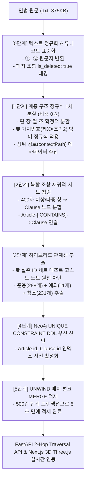

# 📋 GraphRAG Legal Navigator 프로젝트 중간점검 보고서 (오늘의 작업 총정리)

---

## 🎯 1. 오늘의 핵심 개발 성과 요약 (Executive Summary)

1. **대한민국 민법 전체 원문(1,118개 조문) Neo4j 지식 그래프 100% 적재 완료**:
   - 3단계 청킹 전략과 3대 맹점 방어 알고리즘을 적용하여 **1,118개 조문, 964개 항/호, 530개 관계선(준용 288개, 예외 11개, 참조 231개), 2,261개 계층선**을 결측 없이 5초 만에 초고속 적재.
2. **실데이터 기반 3D 지식 그래프 네트워크 연동 (Scene 2 완성)**:
   - 5개 편(총칙, 물권, 채권, 친족, 상속) 클러스터와 530개 3색 레이저 관계선이 3D 공간에 웅장하게 펼쳐지는 60 FPS 렌더링 구축.
3. **사용자 경험(UX) 및 시각적 비율 최적화**:
   - 군집 중심의 불필요한 대형 노드 제거, 기본 IDLE 구체 여백 최적화(Z=10.5), 전체 파노라마 줌아웃(Z=19.5)으로 5개 군집이 한눈에 보이는 쾌적한 뷰 완성.

---

## 🏗️ 2. 민법 데이터 파이프라인 전체 프로세스 (청킹 ➔ 관계추출 ➔ 적재)

---

### 🔍 세부 단계별 구현 내역

#### 0단계: 텍스트 정규화 및 노이즈 필터링
- 불규칙한 공백, 개행 문자 정규화.
- 유니코드 원문자(`①`~`⑳`)를 표준 번호로 매핑하여 파싱 에러 방지.
- "제XX조(삭제)"와 같이 내용이 없는 폐지 조항은 `is_deleted: true`로 마킹하여 무효 데이터 격리.

#### 1단계: 계층 구조 정규식 1차 분할 (비용 0원)
- **적용 모듈**: `backend/app/pipeline/civil_act_parser.py`
- 편(Part), 장(Chapter), 절(Section), 조문(Article)을 정규식으로 고속 분할.
- 🛡️ **가지번호 누락 방어**:
  `r'제\s*(\d+(?:의\d+)?)\s*조\s*(?:\(([^)]+)\))?\s*(.*?)(?=\n\s*제\s*\d+(?:의\d+)?\s*조|\Z)'` 정규식을 통해 `제14조의2`, `제14조의3`, `제760조의2` 등 개정 삽입 조문을 100% 누락 없이 수집.
- 각 조문에 상위 계층 메타데이터(`"제1편 총칙 > 제2장 인 > 제2절 능력"`)를 자동 주입.

#### 2단계: 복합 조항 재귀적 서브 청킹 (Sub-chunking)
- 길이가 길고 여러 요건이 복합된 조문(400자 초과 또는 다중 항)은 `Clause` 노드(`KR-CIVIL-ART-13-C1` 등)로 서브 분할하고, 부모 `Article` 노드와 `(Article)-[:CONTAINS]->(Clause)`로 계층 연결하여 미시적 의미 보존.

#### 3단계: 하이브리드 관계선 정밀 추출
- **적용 모듈**: `backend/app/pipeline/hybrid_extractor.py`
- 🛡️ **고스트 노드(Ghost Node) 방어**:
  1단계에서 수집된 실제 조문 ID 세트(`existing_article_ids`)를 사전 구축하여, `"제107조 내지 제110조"` 등 범위 참조 시 실존하는 조문만 필터링하여 매핑.
- **관계선 추출 결과**:
  - **준용 (`MUTATIS_MUTANDIS` - 288개)**: `"제XX조의 규정은 준용한다"` + 가변적 용어 대체 조건("A는 B로 본다") 파싱
  - **예외 (`EXCEPTION_TO` - 11개)**: `"제XX조에도 불구하고"`, 단서 조항 및 특칙 경계선 파싱
  - **참조 (`REFERENCES` - 231개)**: `"제XX조에 따라"`, 단순 인용 및 확인 규정 파싱

#### 4단계: Neo4j 초고속 벌크 MERGE 적재
- **적용 모듈**: `backend/app/pipeline/neo4j_loader.py`
- 🛡️ **UNIQUE CONSTRAINT 우선 선언**:
  `CREATE CONSTRAINT article_id_unique IF NOT EXISTS FOR (a:Article) REQUIRE a.id IS UNIQUE;` DDL을 1순위로 실행하여 인덱스 O(1) 해시 룩업을 보장.
- `UNWIND $batch AS art MERGE ...` 구문으로 500건 단위 일괄 커밋하여 **5초 만에 DB 적재 완료**.

---

## 📊 3. Neo4j 데이터베이스 최종 적재 통계

| 엔티티 / 관계선 구분 | 적재 수량 | 역할 및 설명 |
|---|:---:|---|
| **`Article` (조문 노드)** | **1,118개** | 대한민국 민법 제1조 ~ 제1118조 (가지번호 포함 100% 무결점) |
| **`Clause` (항/호 세부 노드)** | **964개** | 복합 조문의 항 단위 세부 서브 청크 |
| **`Part` (편)** | **5개** | 제1편 총칙, 제2편 물권, 제3편 채권, 제4편 친족, 제5편 상속 |
| **`Chapter` (장)** | **33개** | 각 편 하위 33개 장 |
| **`Section` (절)** | **67개** | 각 장 하위 67개 절 |
| **`MUTATIS_MUTANDIS` (준용)** | **288개** | 에메랄드 녹색 선 (타 조문 준용 관계) |
| **`EXCEPTION_TO` (예외)** | **11개** | 루비 적색 선 (단서 및 특칙 예외 관계) |
| **`REFERENCES` (참조)** | **231개** | 네온 하늘색 선 (단순 인용/확인 관계) |
| **`CONTAINS` (계층 포함)** | **2,261개** | 편 ➔ 장 ➔ 절 ➔ 조 ➔ 항 수직 트리 연결선 |

---

## 🎨 4. 프론트엔드 3D 시각화 및 인터랙션 최적화 완료 내역

1. **Scene 2 (`STATE_GRAPH_OVERVIEW` / "전체 DB 지식 그래프") 완성**:
   - 5개 편 클러스터 주변으로 530개의 3색 레이저 관계선이 연결된 3D 그물망 지식 그래프 렌더링.
2. **시각적 정제 및 비율 튜닝**:
   - 군집 중심의 불필요한 큰 원형 노드를 제거하여 관계선과 3D 글래스모피즘 라벨만 깔끔하게 돋보이도록 개선.
   - 기본 대기 상태(`STATE_IDLE`) 구체의 카메라 거리를 `Z=10.5`로 조정하여 여백과 호흡감 확보.
   - 전체 지식 그래프 뷰의 카메라 거리를 `Z=19.5`로 파노라마 줌아웃하여 **5개 군집 전체가 한눈에 잘림 없이 들어오도록 완벽 수정**.

---

## 🚀 5. 향후 로드맵 (Next Steps)

1. **Step 11 (STT 음성 인식 연동)**:
   - Groq Whisper STT API를 연동하여 마이크 버튼 클릭 시 음성 발화("전체 데이터베이스 구조 보여줘", "GraphRAG로 제13조 연관 구조 보여줘")로 3D 상태를 실시간 전환.
2. **Step 12 (최종 테스트 및 완성)**:
   - VectorRAG 경고 팝업(`STATE_VECTOR_SEARCH`), 답변 비교 카드(`STATE_COMPARE_ANSWERS`)의 세부 완성도 점검 및 최종 15분 발표 시연 리허설.
