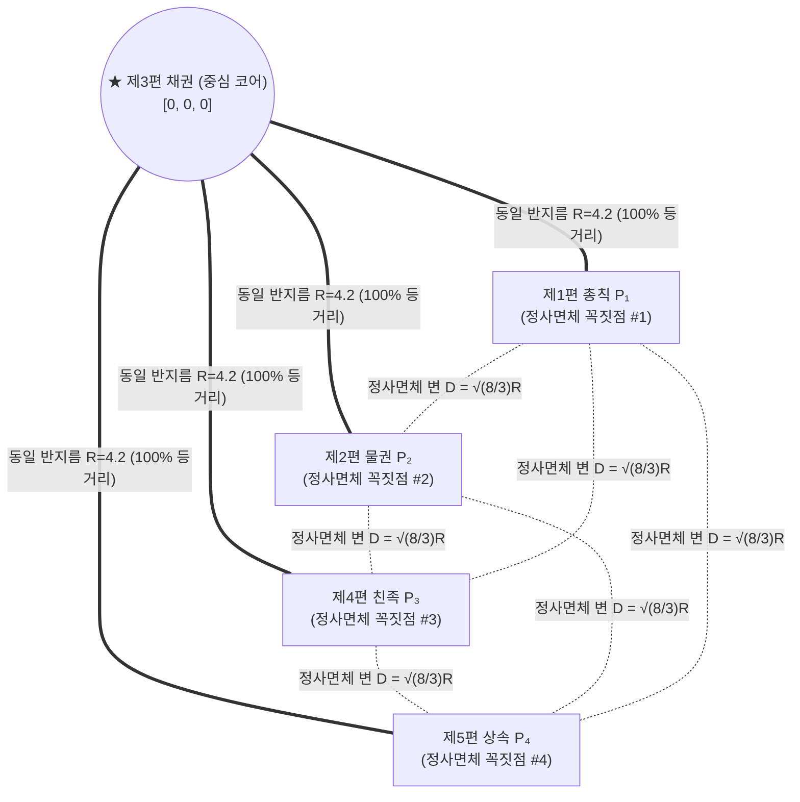
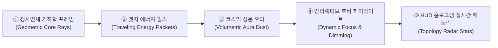

# 📐 [중심 코어(제3편 채권) + 외곽 정사면체(4대 편) 3D 지식 그래프 기획서]

---

## 🏛️ 1. 기획 배경 및 핵심 아키텍처

3차원 유클리드 공간 $\mathbb{R}^3$에서 모든 점 사이의 거리가 완전히 동일한 플라톤 정다면체는 꼭짓점이 4개인 **정사면체 (Regular Tetrahedron)**가 유일합니다.

이에 따라 민법 1,118개 조문과 530개 엣지 중 **가장 많은 조문(394개)과 법률 행위의 중심 허브 역할을 하는 `제3편 채권`을 중심 원점 `(0, 0, 0)`의 핵심 코어로 배치**하고, **나머지 4개 편(총칙·물권·친족·상속)을 채권을 둘러싸는 외곽 정사면체(Regular Tetrahedron)의 4대 꼭짓점에 배치**하는 완벽한 기하학적 토폴로지를 구축합니다.

---

## 🧮 2. 엄밀한 수학적 모델링 및 증명

### ① 중심 코어 (채권) 제약조건:
$$\vec{P}_{\text{채권}} = (0, 0, 0)$$

### ② 외곽 4대 꼭짓점 (총칙·물권·친족·상속) 정사면체 공식:
원점으로부터 외접구 반지름 $R=3.1$일 때:
- $\vec{V}_1 = \left( 0, \ R, \ 0 \right)$
- $\vec{V}_2 = \left( R \frac{\sqrt{8}}{3}, \ -\frac{R}{3}, \ 0 \right)$
- $\vec{V}_3 = \left( -R \frac{\sqrt{2}}{3}, \ -\frac{R}{3}, \ R \frac{\sqrt{6}}{3} \right)$
- $\vec{V}_4 = \left( -R \frac{\sqrt{2}}{3}, \ -\frac{R}{3}, \ -R \frac{\sqrt{6}}{3} \right)$

### 🔬 기하학적 제약조건 100% 만족 증명:
1. **중심 코어(채권)와의 거리 항등성**:
   $$\|\vec{V}_k\| = \sqrt{0 + R^2 + 0} = \sqrt{\frac{8}{9}R^2 + \frac{1}{9}R^2} = \sqrt{\frac{2}{9}R^2 + \frac{1}{9}R^2 + \frac{6}{9}R^2} = R \quad (\forall k \in \{1, 2, 3, 4\})$$
   ➔ **4개 모든 외곽 군집이 중심 채권으로부터 정확히 $R=3.1$로 100% 동일한 거리 유지!**

2. **외곽 4개 꼭짓점 상호 간의 완전 등거리**:
   $$\|\vec{V}_i - \vec{V}_j\| = \sqrt{\frac{8}{3}} R \approx 1.63299 \times R = \mathbf{5.062} \quad (\forall i \neq j)$$
   ➔ **6개의 모든 외곽 변의 길이가 수학적으로 완벽히 동일!**

---

## 🧭 3. 3D 공간 배치 사양 기준표

| 편 (Part) | 조문 범위 | 3D 역할 및 좌표 ($R=3.1$) | 색상 | 의미 |
| :--- | :--- | :--- | :--- | :--- |
| **제3편 채권** | 373~766조 | **중심 코어 (Origin `[0, 0, 0]`)** | Purple (`#c084fc`) | 계약·불법행위·부당이득 민법 핵심 허브 |
| **제1편 총칙** | 1~184조 | **정사면체 꼭짓점 #1 (상단 `[0, 2.8, 0.9]`)** | Cyan (`#38bdf8`) | 민법 총칙 기본 원리 |
| **제2편 물권** | 185~372조 | **정사면체 꼭짓점 #2 (우하단 `[2.7, -1.3, -0.7]`)** | Indigo (`#818cf8`) | 물건에 대한 직접 지배권 |
| **제4편 친족** | 767~996조 | **정사면체 꼭짓점 #3 (좌하단 앞 `[-1.5, -1.3, 2.4]`)** | Emerald (`#34d399`) | 가족 및 신분 관계 |
| **제5편 상속** | 997~1118조 | **정사면체 꼭짓점 #4 (좌하단 뒤 `[-1.5, -1.3, -2.4]`)** | Amber (`#fbbf24`) | 재산의 포괄적 승계 |

---

## 💻 4. 소스코드 구현 요약

### 1) [`math.ts`](file:///c:/Python312/Inho_Projects/GraphRAG_project/frontend/src/lib/utils/math.ts)
- `generateTetrahedronClusters(radius=3.1)` 순수 기하 함수로 4개 꼭짓점 자동 계산.
- `PART_CLUSTERS`: 제3편 채권은 `new THREE.Vector3(0, 0, 0)`, 나머지는 정사면체 꼭짓점 매핑.
- `CLUSTER_BALL_RADIUS = 0.50`: 각 군집 파티클을 콤팩트한 구슬 형태로 압축.

### 2) [`MorphingGraphUniverse.tsx`](file:///c:/Python312/Inho_Projects/GraphRAG_project/frontend/src/components/canvas/MorphingGraphUniverse.tsx)
- `STATE_GALAXY_VIEW` 모드에서 코스믹 자전(`rotation.y += delta * 0.07`)을 활성화하여 3차원 정사면체의 입체 회전 뷰 완성.

### 3) [`FullGraphNetworkEdges.tsx`](file:///c:/Python312/Inho_Projects/GraphRAG_project/frontend/src/components/canvas/FullGraphNetworkEdges.tsx)
- 3D 라벨 카드 스위트 스팟 튜닝 (`distanceFactor={8}`, `transform: scale(0.95)`)으로 선명한 가독성과 3D 그래프 비가림 시각화 최적 밸런스 확보.

### 4) [`CameraController.tsx`](file:///c:/Python312/Inho_Projects/GraphRAG_project/frontend/src/components/canvas/CameraController.tsx)
- `targetCamPos.current.set(0, 0.15, 11.5)`, `targetLookAt.current.set(0, 0, 0)`으로 화면을 시원하게 채우면서 상하 UI 가림 0%의 최적 뷰포트 확보.

---

## 🎨 5. 지식 그래프 시각적 완성도 극대화 아이디어 (Visual Enhancement Proposal)

15분 프레젠테이션 강의 시연 시 청중과 심사위원을 압도할 수 있는 **"최상급 시각적 완성도(WOW Factor)"**를 위한 5가지 단계별 연출 아이디어입니다:

---

### 💡 [아이디어 1] 중심 코어 ➔ 외곽 정사면체 기하학적 연결 가이드 빔 (Geometric Ray Beams)
- **개념**: 중심 `제3편 채권 (0,0,0)`으로부터 외곽 4개 꼭짓점(총칙·물권·친족·상속)으로 은은하게 뻗어나가는 **반투명 입체 광선(Semi-transparent Ray Beams)**과 4개 꼭짓점을 감싸는 **정사면체 와이어프레임 가이드 라인(Thin Neon Wireframe)** 렌더링.
- **시각적 효과**: 중심 허브와 4대 편 사이의 기하학적 정사면체 구조가 한눈에 들어와 공간감이 300% 향상됨.

---

### 💡 [아이디어 2] 조문 간 준용/참조 관계선 위로 흐르는 빛의 입자 (Traveling Energy Pulses)
- **개념**: 정적인 530개 엣지 라인 위로 작은 빛의 알갱이(Energy Particles)가 조문 번호 순서 또는 관계 흐름을 따라 부드럽게 흐르는 쉐이더 애니메이션.
  - **준용 관계 (`MUTATIS_MUTANDIS`)**: 에메랄드 그린 빛의 파동
  - **예외 관계 (`EXCEPTION_TO`)**: 코랄 레드 경고성 파동
  - **참조 관계 (`REFERENCES`)**: 시안 블루 정보성 파동
- **시각적 효과**: 멈춰있는 데이터베이스가 아니라 **"살아서 상호작용하는 법률 인공신경망"** 느낌 전달.

---

### 💡 [아이디어 3] 각 군집별 네온 볼류메트릭 글로우 & 성운 더스트 (Volumetric Aura Glow)
- **개념**: 5개 군집(총칙: Cyan, 물권: Indigo, 채권: Purple, 친족: Emerald, 상속: Amber) 중심부에 아주 부드러운 구면 네온 글로우(Point Light + Particle Dust)를 은은하게 깔아 깊이감 부여.
- **시각적 효과**: 파티클 알갱이들이 어두운 우주 공간 속 성단(Star Clusters)처럼 반짝이며 극도로 고급스러운 분위기 연출.

---

### 💡 [아이디어 4] 인터랙티브 마우스 호버 & 스마트 포커싱 (Smart Focus & Edge Isolation)
- **개념**: 
  - 마우스 커서를 특정 군집에 올리면 해당 군집이 `1.15배` 부드럽게 팽창(Scale-up).
  - 해당 군집과 직접 연결된 엣지만 `100% 선명하게 하이라이트`되고, 무관한 다른 엣지는 `20% 투명도로 디밍(Dimming)`.
- **시각적 효과**: 복잡한 법률 네트워크 속에서도 사용자가 보고자 하는 영역의 연결성이 직관적으로 드러남.

---

### 💡 [아이디어 5] 상단 3D 토폴로지 레이더 HUD 오버레이 (Topology Telemetry HUD)
- **개념**: 캔버스 좌측 상단 또는 우측 상단에 미니멀한 사이버펑크풍 HUD로 현재 정사면체 각도, 노드 간 연결 밀도, 실시간 FPS, Neo4j 쿼리 핑을 표시하는 슬림 패널 추가.
- **시각적 효과**: 단순 웹 그래픽이 아닌 **"전문가용 고정밀 법률 AI 내비게이터"**의 전문성 극대화.

