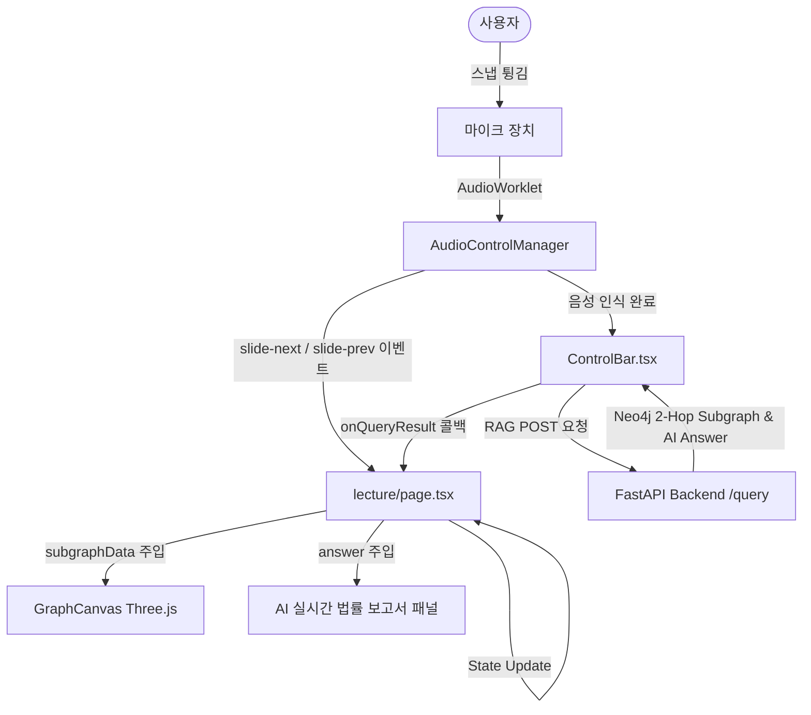

# 🧭 GraphRAG 음성 제어 강의 시스템 통합 계획 및 진행 기록 (Integration.md)

본 문서는 음성 제어 및 실시간 GraphRAG 백엔드 파이프라인 기능을 `http://localhost:3000/lecture` 페이지에 통합하는 개발 진행 상황을 기록하고 추적하는 문서입니다.

---

## 🎯 1. 통합 목표 (Objectives)
- [ ] **슬라이드 카드 렌더링 통합**: `lecture/page.tsx` 내에 `PresentationSlideCard` 컴포넌트를 올바르게 탑재하여 강의용 슬라이드 오버레이 UI 구현.
- [ ] **음성 명령 고도화**: `ControlBar.tsx` 내 음성 인식 명령어 매핑에 "다음" / "넘어가기" 등 슬라이드 넘김 커맨드 추가.
- [ ] **실시간 RAG 질의 결과 연동**: Demo 3 (실시간 RAG 쿼리 시연) 슬라이드(Slide 11)에서 사용자가 음성이나 타이핑으로 질문했을 때 백엔드 API 응답(`subgraph` 및 `legal_answer`)을 화면에 동적으로 반영하도록 상태 바인딩 구축.
- [ ] **3D 그래프 캔버스 렌더링 갱신**: RAG 질의 완료 시 live subgraph 정보를 `GraphCanvas`에 전달하여 실시간 레이저 및 노드 연결 효과 시각화.
- [ ] **디자인 가이드라인 준수**: Glassmorphism 디자인 스펙 및 슬라이드 상태별 동적 블러(Dimming) 효과 처리.

---

## 🗺️ 2. 시스템 아키텍처 및 데이터 흐름

---

## 📝 3. 개발 체크리스트 (Task Checklist)

### 3.1. [ControlBar.tsx](file:///c:/Python312/Inho_Projects/GraphRAG_project/frontend/src/components/ui/ControlBar.tsx) 수정
- [ ] 음성 제어 명령어 파서(`handleVoiceCommand`)에 `다음`, `넘겨줘`, `넥스트` 키워드 감지 시 `slide-next` 커스텀 이벤트 디스패치 로직 추가.

### 3.2. [GraphRAGAnswerPanel.tsx](file:///c:/Python312/Inho_Projects/GraphRAG_project/frontend/src/components/overlays/GraphRAGAnswerPanel.tsx) 수정
- [ ] `renderFormattedAnswer` 및 `formatInlineText` 함수를 export하여 다른 컴포넌트(강의 페이지 등)에서도 구조화된 AI 답변 파서를 재사용할 수 있도록 개편.

### 3.3. [lecture/page.tsx](file:///c:/Python312/Inho_Projects/GraphRAG_project/frontend/src/app/lecture/page.tsx) 수정
- [ ] `PresentationSlideCard` 렌더링 추가 (`!currentSlide.isDemo`일 때 오버레이).
- [ ] `liveSubgraphData`, `liveAnswer`, `liveQuery` React 상태(state) 추가.
- [ ] `ControlBar`에 `onQueryResult` 및 `onSearchStart` 콜백 함수 바인딩.
- [ ] 3D Graph Canvas에 `isBlurred` 옵션을 `currentSlide.isBlurred`에 연동하여 텍스트 가독성을 위한 동적 디밍 구현.
- [ ] Demo 3 법률 보고서 패널에 `renderFormattedAnswer`를 적용하여 실제 RAG 질의 결과 렌더링.

---

## 📈 4. 진행 현황 (Progress Log)
- **2026-08-25**: 
  - `Integration.md` 기획 및 명세 작성 시작.
  - 소스코드 구조 분석 및 변경 요소 획득 완료.

루트폴더에 새로 integration.md 파일 만들었고 이제 여기에 하나하나 기록하면서 진행하면 돼. 이 마크다운 파일의 용도는 토큰 낭비와 제대로 기억할 수 있도록 기억 유지와 목표설정하는데에 있어.
자 이제 우리가 해야할 거 알려줄게. whisper.md를 참고하면 이제 음성을 이용한 제어 기능을 구현했던게 있으니까 그걸 확인하고 (http://localhost:3000/lecture) 이 페이지에 여태까지 구현한걸 통합해서 완성해야해. 우리는 음성제어를 통한 graphrag 이론강의를 해야하고 강의 주제는 lecture.md를 참고하면 돼.