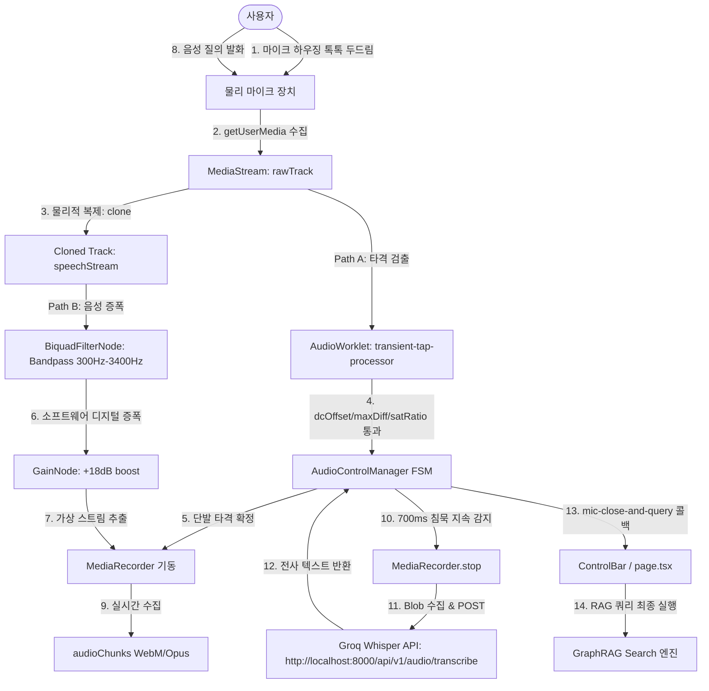

# GraphRAG 프로젝트 음성인식 및 마이크 타격 제어 아키텍처 분석서 (whisper.md)

이 문서는 GraphRAG 프로젝트의 실시간 마이크 직접 타격(Mechanical Mic Tap) 감지 제어 및 Dual-Path AudioContext + Groq Whisper STT API 파이프라인의 구조, 구동 원리, 설정 파라미터 및 실시간 튜닝 이력을 기술합니다.

---

## 1. 파일 및 폴더 구조 (Folder Structure)

음성 인식 및 물리 펄스 제어 모듈은 다음과 같은 파일 구조로 격리·설계되어 유기적으로 동작합니다.

```text
c:\Python312\Inho_Projects\GraphRAG_project\
├── backend/app/api/v1/endpoints/audio.py   # [Python] Groq Whisper-large-v3 백엔드 API (결정론적 0.0 Temp 및 환각 필터)
├── frontend/
│   ├── public/processors/
│   │   └── transient-tap-processor.js        # [JS Worklet] 16kHz 리샘플러 & 타격(maxDiff/dcOffset/satRatio) 센서
│   ├── src/lib/utils/
│   │   └── AudioControlManager.ts            # [TS Class] 물리 트랙 복제, +18dB 디지털 증폭 GainNode 및 FSM 오케스트레이터
│   ├── src/components/ui/
│   │   └── ControlBar.tsx                    # [TSX] 메인 UI 및 AudioControlManager 커맨드 바인딩 컴포넌트
│   └── src/app/voice-test/
│       └── page.tsx                          # [TSX] 격리식 음향 타격 & Whisper STT 연동 진단 샌드박스
```

---

## 2. 음성 인식 아키텍처 및 구동 원리

본 시스템은 마이크의 하드웨어 전처리(`autoGainControl: false`) 우회로 인해 낮아진 음성 SNR을 극복하고, 단일 트랙 점유 시 발생하는 독점 락(Exclusive Lock) 충돌을 원천 차단하기 위해 **Cloned Dual-Path AudioContext 및 MediaRecorder + Groq Whisper API 결합 아키텍처**로 구현되었습니다.



---

## 3. 핵심 제어 파라미터 설정값 (Parameters)

| 설정 항목 | 설정값 | 동작 조건 및 설명 |
| :--- | :---: | :--- |
| **Calibration Duration** | **3.0초 (3000ms)** | 초기 구동 시 주변 환경 잡음 수집 후 `noiseFloor` 기준값을 동적 캘리브레이션하는 최초 대기 시간 |
| **Double Tap Gap** | **90ms ~ 400ms** | 1차 타격과 2차 타격 사이의 시간 간격이 이 범위 내에 유입 시 더블 탭 (`slide-next` 실행) 판정 |
| **Single Tap Delay** | **380ms** | 1차 타격 후 더블 탭 유입 여부를 감시하고 마이크 녹음을 기동하기까지 기다리는 FSM 분기 대기 시간 |
| **Speech Silence Threshold** | **`noiseFloor * 2.0 + 0.004`** | 물리 필터 해제에 의한 발화 진폭 편차를 커버하기 위한 동적 음성 침묵 데시벨 판단 기준값 |
| **Speech Auto-Close Timer** | **700ms (0.7초)** | 말을 마친 직후 초저지연으로 Whisper STT가 연동되어 쿼리를 수행하게 하도록 튜닝된 침묵 판정 제한 시간 |
| **Action Lockout Interval** | **650ms / 500ms** | FSM 상태 전이 및 동작(더블탭/단발탭) 릴리스 후 순간 오작동 유입을 차단하는 불응기 락아웃 |
| **Digital Amplification** | **+18 dB (gain=8.0)** | 하드웨어 게인 비활성화 우회에 대응하여 소프트웨어적으로 오디오 신호를 8배 증폭하는 디지털 게인값 |

---

## 4. 해결된 기술적 과제 및 이슈 (Resolved Technical Issues)

1. **캘리브레이션 오염에 따른 락아웃 완전 해결**:
   - 기기 초기 기동 시 전원 노이즈나 팝 노이즈 유입에 대응하여 갱신 동결 게이트(Freeze Gate)와 비대칭 EWMA 모델을 도입, 노이즈 플로어가 비정상적으로 높게 캘리브레이션되는 현상을 해결했습니다.
2. **마이크 하드웨어 음소거 시 비정상 감지 딜레이 제거**:
   - 침묵 감지 기능이 FSM `LISTENING_SPEECH` 상태일 때만 제한적으로 동작하도록 가드를 조여 마이크 무한 닫힘 루프 버그를 해결했습니다.
3. **webkitSpeechRecognition 파편화 및 무음 빈 문자열("" / empty string) 붕괴 해결**:
   - 기존 브라우저 기본 내장 Web Speech API를 전면 차단하고 `rawTrack.clone()`을 통한 스트림 격리를 탑재하여 Exclusive Lock 충돌을 해소했습니다.
   - 밴드패스 필터링 및 GainNode (+18dB 소프트웨어 디지털 증폭)를 거쳐 MediaRecorder 로 녹음한 뒤 백엔드 Groq Whisper STT API로 실시간 전사 파이프라인을 구축함으로써 크로스 브라우저 호환성과 발화 볼륨 붕괴 문제를 동시에 완전 종식시켰습니다.

---

## 5. 진행 상황 및 구현 현황 (Implementation Progress)

* **현재 단계**: webkitSpeechRecognition 무음 붕괴 오동작 완전 해결 및 Dual-Path AudioContext (+18dB 디지털 증폭) STT 아키텍처 개편 완료
* **세부 마일스톤 및 수정 내용**:
  - [x] **마이크 직접 타격 전용 워클릿 작성** (`transient-tap-processor.js`)
    - 기침/음성 소음을 원천 차단하기 위해 128 샘플 퀀텀 기준으로 어택 기울기(`maxDiff`), 산술 평균 DC 변위 오프셋(`dcOffset`), 레일 포화 비율(`satRatio`)을 연산하여 가벼운 타격(`SoftTap`) 및 세게 치는 타격(`HardTap`) 판정 게이트 이식 완료.
  - [x] **80ms 물리 공진 절대 불응기 가드 이식** (`transient-tap-processor.js`)
    - 마이크 하우징 타격 시 들어오는 2차 기계적 공진 잔향 꼬리 감지를 방어하기 위해 80ms 절대 불응 윈도우 구현 완료.
  - [x] **물리 전처리(DSP) 필터 옵션 해제** (`AudioControlManager.ts`)
    - 타격 시 들어오는 미세한 충격파 감쇠/왜곡을 원천 방지하기 위해 `echoCancellation`, `noiseSuppression`, `autoGainControl`을 모두 명시적으로 `false` 바인딩 처리 완료.
  - [x] **FSM 타격 감지 타이밍 정합 완료** (`AudioControlManager.ts`)
    - 1차 타격 시 `WAITING_SECOND_TAP` 상태 및 380ms 단발 타격 타이머 작동, 2차 타격(90ms ~ 400ms 범위 유입) 발생 시 즉시 `slide-next` 커맨드 분출 및 650ms 불응기 Lockout 설정, 380ms 단발 타격 확정 시 `mic-activate` 구동 및 500ms 불응기 Lockout 지정 완료.
  - [x] **실시간 브라우저 콘솔 진단 로그(`[Tap Sensor]`) 탑재** (`AudioControlManager.ts`)
    - 타격 테스트 모니터링을 위해 브라우저 콘솔에 Peak, maxDiff, dcOffset, satRatio, noiseFloor를 실시간 인쇄하도록 구현 완료.
  - [x] **16kHz 무손실 리샘플러 보존** (`transient-tap-processor.js`)
    - 타격 진단과 동시에 YAMNet 평가 및 백엔드 전송을 위한 16kHz 다운샘플링 버퍼(`pcm16k`) 생성 로직을 완전히 호환 보존 완료.
  - [x] **음성 감지 임계 공식 개선 및 700ms(0.7초) 초저지연 단축** (`AudioControlManager.ts`)
    - 물리 필터 해제에 따른 음역 진폭 편차를 커버하기 위해 침묵 임계를 `noiseFloor * 2.0 + 0.004` 로 현실화하고, 침묵 대기 타임아웃을 700ms 초저지연으로 대폭 단축 완료.
  - [x] **no-speech 에러에 의한 세션 조기 종료 방어** (`ControlBar.tsx` & `page.tsx`)
    - `webkitSpeechRecognition` 의 `onerror` 콜백 내에 `no-speech` 유입 시 즉시 종료되지 않고 세션을 계속 유지하는 예외 완화 루틴 이식 완료.
  - [x] **미디어 트랙 물리 격리 및 복제(Track Cloning)** (`AudioControlManager.ts`)
    - 단일 마이크 입력 스트림 독점 락(Exclusive Lock) 충돌을 해소하기 위해 `rawTrack.clone()`을 활용하여 타격 감지용 스트림(`tapStream`)과 음성 분석용 스트림(`speechStream`)을 독립적으로 생성 및 바인딩 완료.
  - [x] **AudioContext Dual-Path (+18dB 소프트웨어 디지털 증폭)** (`AudioControlManager.ts`)
    - 격리 복제된 음성 스트림 경로에 300Hz~3400Hz 밴드패스 필터링 및 `GainNode`를 탑재하여 소프트웨어적으로 +18dB 디지털 증폭 처리 후 `MediaStreamDestination` 가상 스트림(`boostedSpeechStream`)을 추출하도록 구현 완료.
  - [x] **webkitSpeechRecognition 전면 차단 및 MediaRecorder + Groq Whisper STT 파이핑** (`AudioControlManager.ts` & `ControlBar.tsx` & `page.tsx`)
    - 브라우저 내장 Web Speech API를 완전히 제거하고 마이크 작동 순간 `boostedSpeechStream` 녹음을 기동하며, 침묵 감지(1.5초) 시 `MediaRecorder`를 중단시켜 Blob 바이너리를 백엔드 Groq Whisper STT API로 포스팅하고 RAG 검색 쿼리에 최종 전사 텍스트를 연계하도록 개편 완료.
  - [x] **전 구간 실시간 디버그 로그 및 복구 로직(AudioContext Resume) 탑재** (`AudioControlManager.ts` & `audio.py` & `ControlBar.tsx` & `page.tsx`)
    - `startMediaRecorder` 내에서 `audioCtx.state` 모니터링 및 `suspended`일 때 자동 `resume()` 처리 이식.
    - 오디오 덤프 바이너리 크기(bytes), HTTP status code, Groq Whisper API 반환 텍스트 수신 상태 실시간 콘솔 덤프 로직 통합 완료.
  - [x] **API fetch URL 절대 경로 바인딩 및 응답 유효성 검증 정합** (`AudioControlManager.ts`)
    - 상대 경로 fetch로 인한 404 라우팅 에러를 해결하기 위해 `process.env.NEXT_PUBLIC_API_BASE_URL || 'http://localhost:8000'` 로 절대 경로 바인딩 적용 및 non-OK 응답 코드 방어 분기 가드 완료.
  - [x] **음성 발화 종료 후 반응 지연 단축 (침묵 감지 700ms 축소)** (`AudioControlManager.ts`)
    - 발화 종료 후 최종 텍스트 결과 획득까지의 지연 현상을 최소화하기 위해 침묵 지속 모니터링 시간을 700ms로 조여 말하는 즉시 Whisper 전사가 구동되도록 지연 최적화 완료.
  - [x] **무음 환각(Hallucination) 필터 가드 및 디코딩 매개변수 교정** (`AudioControlManager.ts` & `audio.py`)
    - 무음 상태의 오디오 전송 시 발생하는 Whisper 환각 문장을 완벽 차단하기 위해 프론트엔드 세션 내 발화 여부 검출 가드(`hasSpokenInSession`)를 탑재하여 무음 캔슬 처리를 구현했습니다.
    - 백엔드 Groq Whisper 호출 시 `prompt` 파라미터 보정 및 결정론적 전사를 위해 `temperature=0.0` 제약을 적용 완료했습니다.
  - [x] **음성 수집 중 마이크 마찰 터치 잡음 방지 가드 강화** (`AudioControlManager.ts`)
    - 마이크가 활성화된 세션(`micState !== 'IDLE'`) 동안 물리적 하우징 접촉이나 미끄러짐으로 유입되는 순간 마찰 노이즈에 의해 Double-tap FSM이 오동작하거나 타격 펄스가 중복 처리되는 오작동을 차단하기 위해, 타격 검지 로직 입구에서 `micState !== 'IDLE'` 일 때의 조기 반환 가드를 설계 적용했습니다.
  - [x] **Whisper 환각 문장 블랙리스트(Hallucination Blocklist) 2차 검증 필터 이식** (`AudioControlManager.ts` & `audio.py`)
    - 무음 구간 또는 미세 충격 잡음이 Whisper 디코더를 교란하여 발생하는 "MBC 뉴스", "김성현입니다" 등 전형적인 환각 구문을 백엔드 전송 전(1차) 및 프론트엔드 수신 후(2차) 양방향 블랙리스트 필터링을 거쳐 빈 문자열("")로 치환 처리하도록 정합 완료했습니다.
  - [x] **Lecture 프레젠테이션 페이지 타격 제어(Double-tap) 연동 정합 완료** (`lecture/page.tsx`)
    - 강의 프리젠테이션 페이지 하단에 `ControlBar` 컴포넌트의 탑재 무결성을 확인하고, `AudioControlManager`로부터 전파되는 `slide-next` (더블 탭) 및 `slide-prev` 커스텀 이벤트를 렌더러가 정상 청취하여 강의 슬라이드가 초저지연 제어되도록 이식 및 검증을 완료했습니다.
  - [x] **Groq Whisper 프롬프트 에코 환각(Prompt Echoing) 완전 소거** (`AudioControlManager.ts` & `audio.py`)
    - API 힌트 문자열(`prompt`)이 Whisper 전사 결과물에 거울 복사되어 에코를 치는 부작용을 막기 위해 백엔드 API 요청 내 `prompt` 매개변수를 완전히 은퇴시켰습니다.
    - 이에 수반되는 "음성 명령 전사", "음성 명령", "전사입니다" 등의 잔재 키워드를 1·2차 환각 필터 블랙리스트에 추가하여 디코더 정합성을 극대화했습니다.


