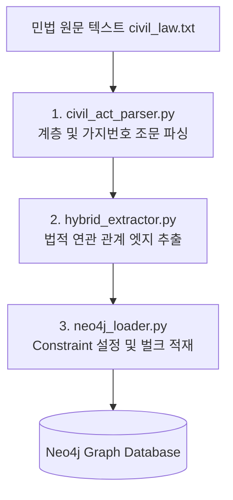

# ⚖️ 대한민국 민법 Neo4j GraphRAG 백엔드 분석 및 이론 강의 자료

본 문서는 대한민국 민법을 그래프 데이터베이스(Neo4j)에 구조화하여 적재하고, 이를 기반으로 LLM(Gemini)과 연동하여 정밀한 법률 질의응답을 구현한 **GraphRAG 시스템의 백엔드 분석 보고서**이자 **이론 강의 슬라이드 기획안**입니다.

---

## 📂 1. 백엔드 폴더 구조 및 파일 해부

백엔드 시스템은 FastAPI 프레임워크를 기반으로 모듈성과 유지보수성을 극대화하기 위해 레이어드 아키텍처(Layered Architecture)를 채택하고 있습니다.

```
backend/
├── app/
│   ├── api/
│   │   └── v1/
│   │       ├── endpoints/
│   │       │   ├── audio.py          # 음성 인식(Whisper) API
│   │       │   ├── graph.py          # 지식 그래프 조회 및 RAG 질의 API
│   │       │   └── health.py         # DB 및 서버 상태 헬스체크 API
│   │       └── router.py             # API 버저닝 및 라우팅 엔드포인트 통합
│   ├── core/
│   │   ├── config.py                 # 환경변수(.env) 및 시스템 설정 로드
│   │   └── logging.py                # 통일된 시스템 로거 설정
│   ├── models/
│   │   ├── graph.py                  # 그래프 노드 및 엣지 Pydantic 모델
│   │   └── query.py                  # 질의 응답 요청/응답 Pydantic 모델
│   ├── pipeline/
│   │   ├── ingest.py                 # 적재 파이프라인 총괄 메인 스크립트
│   │   ├── civil_act_parser.py       # 민법 텍스트 파서 (계층 구조 분해)
│   │   ├── hybrid_extractor.py       # 조문 간 법률적 연관 관계(엣지) 추출
│   │   └── neo4j_loader.py           # Neo4j 데이터 벌크 로더
│   ├── services/
│   │   ├── llm_service.py            # Gemini API (Groq 폴백) 연동 서비스
│   │   └── neo4j_service.py          # Neo4j 커넥션 및 서브그래프 쿼리 서비스
│   └── main.py                       # FastAPI 애플리케이션 초기화 및 미들웨어 설정
├── data/
│   └── civil_law.txt                 # 대한민국 민법 원문 텍스트 데이터
└── requirements.txt                  # 백엔드 의존성 패키지 목록
```

---

## ⚙️ 2. 데이터 적재 파이프라인 (Data Ingestion Pipeline)

대한민국 민법 원문(`civil_law.txt`)에서 지식 그래프(Knowledge Graph)가 구축되어 Neo4j에 로드되기까지의 파이프라인 흐름은 다음과 같습니다.



### 1) 텍스트 구조 파싱 (`civil_act_parser.py`)
* **목적**: 비구조화된 법률 텍스트에서 민법의 편(Part) > 장(Chapter) > 절(Section) > 조(Article) > 항(Clause) 계층을 추출합니다.
* **가지번호 대응**: '제14조의2'와 같이 본 번호 뒤에 '의X'가 붙는 하위 조문을 방어하기 위해 조문 식별자(`KR-CIVIL-ART-14-2`)와 매핑 구조를 구현하여 단순 숫자로 변환 시 발생할 수 있는 노드 충돌을 방지합니다.
* **항(Clause) 분할**: 조문 내부의 원형 문자(①~⑳)를 매핑 딕셔너리를 사용해 탐색하고 분할하여, 개별 항 단위 노드(`KR-CIVIL-ART-13-C1` 등)를 생성합니다.

### 2) 법률 연관 관계 추출 (`hybrid_extractor.py`)
* **목적**: 텍스트 규칙 분석 및 정규표현식을 이용하여 조문 상호 간의 법적 연계 엣지를 추출합니다.
* **추출하는 관계 유형**:
  * `MUTATIS_MUTANDIS` (준용): 다른 조문을 그대로 가져다 적용하는 규정 ("준용한다" 매칭). 치환 조건(Modifications)이 본문에 존재할 경우 타겟 노드와 치환 정보도 함께 저장합니다.
  * `EXCEPTION_TO` (예외): 본문의 한계나 특칙을 설정하는 규정 ("불구하고", "단서", "다만" 매칭).
  * `REFERENCES` (참조): 관계 기술어 없이 특정 조문을 단순 언급하거나 인용하는 경우.
* **고스트 노드(Ghost Node) 방지**: 추출된 타겟 조문 ID가 파싱 과정에서 실제 생성된 조문 ID 세트(`existing_article_ids`) 내에 실재하는 경우에만 엣지를 생성하여, 데이터베이스에 존재하지 않는 허상의 노드를 참조하려다 발생하는 댕글링 관계 오류를 완전히 차단합니다.

---

## 💾 3. 데이터베이스 적재 기술 (Neo4j Optimization)

적재 연산 시 성능 향상과 트랜잭션 오버헤드 감소를 위해 `neo4j_loader.py`에 적용된 핵심 기술은 다음과 같습니다.

### 1) UNIQUE CONSTRAINT 선언 (O(1) 인덱스 보장)
데이터 적재 전, Neo4j 스키마 제약조건 DDL을 최우선 실행하여 노드 식별자(`id`)의 중복을 막고 해시 테이블 방식의 조회를 보장합니다. 이로써 `MERGE` 연산 시 매번 노드 전체를 스캔하지 않고 O(1) 시간에 타겟 노드를 찾아 수정/비교 작업을 처리합니다.
```cypher
CREATE CONSTRAINT part_id_unique IF NOT EXISTS FOR (p:Part) REQUIRE p.id IS UNIQUE
CREATE CONSTRAINT chapter_id_unique IF NOT EXISTS FOR (c:Chapter) REQUIRE c.id IS UNIQUE
CREATE CONSTRAINT section_id_unique IF NOT EXISTS FOR (s:Section) REQUIRE s.id IS UNIQUE
CREATE CONSTRAINT article_id_unique IF NOT EXISTS FOR (a:Article) REQUIRE a.id IS UNIQUE
CREATE CONSTRAINT clause_id_unique IF NOT EXISTS FOR (cl:Clause) REQUIRE cl.id IS UNIQUE
```

### 2) 멱등성(Idempotency) 확보
적재 시작 시 `MATCH (n) DETACH DELETE n`을 실행하여 이전의 모든 그래프 노드 및 엣지 관계를 삭제함으로써, 여러 번 파이프라인을 기동하더라도 중복 노드가 쌓이지 않는 깔끔한 초기 상태에서 적재되도록 보장합니다.

### 3) `UNWIND` 기반 벌크 로딩 (Bulk Ingestion)
매 노드/엣지 생성마다 네트워크 왕복(Round-trip) 및 커밋 요청을 보내는 방식 대신, 500개 단위의 배치 데이터를 JSON 리스트 형태로 한 번에 넘겨 `UNWIND` Cypher 명령으로 루프 처리하여 적재 속도를 수십 배 이상 극대화합니다.
```cypher
// 예시: Article 벌크 MERGE 쿼리
UNWIND $batch AS art
MERGE (a:Article {id: art.id})
ON CREATE SET 
    a.number_str = art.number_str,
    a.number_base = art.number_base,
    a.number_branch = art.number_branch,
    a.title = art.title,
    a.name = art.name,
    a.fullText = art.fullText,
    a.summary = art.summary,
    a.contextPath = art.contextPath,
    a.is_deleted = art.is_deleted
```

---

## 🔍 4. 질문 인식 및 사이퍼 쿼리 변환 메커니즘

사용자의 질문을 해석하고 관련 그래프 영역을 찾아 RAG 컨텍스트를 완성하는 일련의 과정은 다음과 같습니다.

### 1) 3단계 하이브리드 질문 인식 (Retrieval Flow)
질문 텍스트가 유입되면, `neo4j_service.py`의 `get_dynamic_rag_subgraph` 메서드가 작동하여 가장 적절한 '중심 조문(Center Article)'을 포착합니다.

```mermaid
graph TD
    user_q[사용자 자연어 질문] --> step1{1단계: 규칙 기반 매핑<br>keyword_article_map}
    step1 -- 매칭 성공 --> subgraph[조문 서브그래프 탐색]
    step1 -- 매칭 실패 --> step2{2단계: DB 동적 키워드 검색<br>CONTAINS 쿼리}
    step2 -- 조회 성공 --> subgraph
    step2 -- 조회 실패 --> step3[3단계: Fallback<br>제13조 기본 반환]
    step3 --> subgraph
```

* **1단계 (규칙 기반 매핑)**: 질문 텍스트 내 특정 민법 키워드가 존재하면 미리 지정된 핵심 조문 번호를 Center로 확정합니다.
  * 예: `"토지 무단 점유"`, `"철거"`, `"방해제거"` -> **제214조** (소유물방해제거)
  * 예: `"취득시효"`, `"20년 점유"` -> **제245조** (점유취득시효)
  * 예: `"손해배상"`, `"불법행위"` -> **제750조** (불법행위책임)
* **2단계 (DB 동적 검색)**: 질문 내 명사 키워드 리스트를 추출해 Neo4j 내 `Article` 노드의 `fullText`, `title`, `name`, `summary` 필드 중 하나라도 포함하는 노드를 동적으로 1개 매칭합니다.
* **3단계 (기본 Fallback)**: 위 두 단계에서 모두 실패하면 기본 중심 조문을 **제13조**로 자동 설정하여 크래시를 방지합니다.

### 2) Multi-Hop Cypher 쿼리 탐색
선정된 Center 조문을 기준으로 1~2 hop 이웃 조문들 간의 법적 연계 경로를 양방향(`-`)으로 한 번에 수집하는 확장 Cypher 쿼리를 실행합니다.
```cypher
MATCH (center:Article)
WHERE center.id = $raw_query 
   OR center.id = 'KR-CIVIL-ART-' + $query_str
   OR center.number_str = $query_str
   OR center.number_base = toInteger($query_str)
OPTIONAL MATCH path = (center)-[r:MUTATIS_MUTANDIS|EXCEPTION_TO|REFERENCES*1..2]-(neighbor:Article)
RETURN center, relationships(path) AS rels, nodes(path) AS path_nodes
```
이 쿼리는 해당 조문이 준용하는 조항뿐 아니라, 반대로 해당 조문을 참조하거나 예외 규정으로 두고 있는 인접 노드 네트워크 전체를 RAG용 법률 배경 지식으로 획득하도록 보장합니다.

---

## 📝 5. 백엔드에서 활용하는 정규표현식(Regex)의 개념과 적재 원리

정규표현식은 자연어 형태의 비구조화된 법률 문서를 컴퓨터가 처리할 수 있는 관계형 데이터 구조로 변환하여 Neo4j에 로딩하기 위해 사용됩니다.

### 1) 정규표현식의 개념 및 사용처
* **개념**: 정규표현식은 텍스트에서 특정한 규칙을 가진 문자열 패턴을 간결하게 찾아내거나 치환하는 도구입니다.
* **적재 파이프라인에서의 쓰임**:
  * **구조 분해**: 대용량 민법 원문에서 `제X편`, `제X장`, `제X절`, `제X조`가 시작되는 시작 위치를 감지하여 개별 Node 오브젝트로 쪼갭니다.
  * **가지번호 분리**: `제14조의2`와 같이 `의`가 포함된 특수 조문 번호 패턴을 검출하여 기본 번호(`14`)와 가지 번호(`2`)로 각각 필드를 분할해 저장합니다.
  * **참조 타겟 검출**: 조문 텍스트 내에서 `제107조`, `제108조` 같은 인용 패턴을 스캔하여 관계선(Edge)을 생성할 대상 노드 ID를 찾아냅니다.

### 2) 적용 패턴 요약
| 대상 파일 | 정규표현식 패턴 | 활용 목적 |
| :--- | :--- | :--- |
| `civil_act_parser.py` | `r'^\s*제\s*([0-9]+)\s*편\s+(.+)$'` | "제1편 총칙" 등 편 단위 노드 생성용 패턴 검출 |
| `civil_act_parser.py` | `r'^\s*제\s*([0-9]+)\s*장\s+(.+)$'` | 장 단위 노드 생성용 패턴 검출 |
| `civil_act_parser.py` | `r'^\s*제\s*([0-9]+)\s*절\s+(.+)$'` | 절 단위 노드 생성용 패턴 검출 |
| `civil_act_parser.py` | `r'^\s*제\s*(\d+(?:의\d+)?)\s*조\s*(?:\(([^)]+)\))?\s*(.*)$'` | 조 번호(가지번호 포함), 조 이름, 본문 시작 라인을 파싱하고 조 노드를 구성하기 위해 사용 |
| `hybrid_extractor.py` | `r'제\s*(\d+(?:의\d+)?)\s*조'` | 조문 텍스트 내부에서 인용하는 다른 단일 조문(`REFERENCES` 엣지 대상) 검출 |
| `hybrid_extractor.py` | `r'제\s*(\d+)\s*조\s*(?:내지|부터)\s*제?\s*(\d+)\s*조'` | 범위 형태의 조문 인용(예: "제107조 내지 제110조")을 검출해 범위 안의 모든 조문과 엣지 연결 |
| `hybrid_extractor.py` | `r'["\']([^"\']+)["\']\s*(?:은|는|을|를)\s*["\']([^"\']+)["\']\s*(?:로|으로)\s*본다'` | 준용 시 단어 치환 규칙(예: "이 경우 '채무자'는 '해제권자'로 본다")을 검출해 속성값으로 매핑 |

---

## 🤖 6. LLM(Gemini) 연동 및 RAG 프롬프팅

### 1) 최신 GenAI SDK 연동
구버전 패키지(`google-generativeai`) 대신 최신 표준인 `google.genai` SDK를 사용합니다.
* **모델**: `gemini-3.6-flash` (현 레포지토리 API 키 검증 모델)
* **비동기 처리(Thread Pool Wrapping)**: Gemini SDK의 호출 함수(`client.models.generate_content`)가 동기적으로 실행되어 FastAPI의 단일 이벤트 루프를 블로킹하지 않도록, `asyncio.get_event_loop().run_in_executor`를 활용해 스레드 풀에서 비동기 호출을 구현했습니다.

### 2) 시스템 프롬프트(System Prompt) 엔지니어링
RAG의 할루시네이션(환각) 현상을 억제하고 민법 전문 변호사 수준의 입체적 솔루션을 제공하도록 시스템 프롬프트에 명확한 역할을 부여합니다.

* **출처 명시 규칙**: 반드시 컨텍스트로 주어지는 조문 번호(예: 제214조, 제750조 등)를 본문에 언급할 것.
* **다차원 연계 추론 유도**: 토지 무단 구조물 점유 예시 발생 시, **물권적 청구** (제214조 방해제거/철거, 제213조 인도) + **채권적 청구** (제741조 부당이득 반환, 제750조 불법행위 손해배상) + **방어 및 시효 차단** (제245조 취득시효)을 체계적으로 엮어 입체적으로 제시하도록 가이드합니다.
* **길이 및 형식 제약**: 답변은 500자 내외로 매우 압축하여 군더더기 없이 결론 위주로 마크다운 출력하도록 강제합니다.

---

## 📊 7. 이론 강의용 슬라이드 11개 구성안

아래는 백엔드 분석 내용을 기반으로 이론 강의를 진행하기 위한 **슬라이드별 상세 목차와 핵심 메시지 템플릿**입니다.

### [슬라이드 1] 타이틀 및 학습 목표
* **제목**: Neo4j GraphRAG 구현체 기반: 실전 대한민국 민법 AI 아키텍처 해부
* **핵심 메시지**: 지식 그래프 구축부터 LLM 연동 실시간 법률 추론까지의 동작 흐름 마스터
* **슬라이드 내용**:
  * 단순 Vector RAG의 한계점 (조문 간 유기적 구조와 준용/예외 누락)
  * GraphRAG의 솔루션 (온톨로지 하이어라키 + 법적 연계 관계망 그래프 적용)
  * 강의 진행 순서 소개 (적재 -> 스키마 -> 쿼리 및 검색 -> LLM 추론)

### [슬라이드 2] 백엔드 폴더 구조와 역할 분담
* **제목**: FastAPI 레이어드 아키텍처 구조
* **핵심 메시지**: 모듈화와 확장성을 최적화한 FastAPI 백엔드 레이어 설계
* **슬라이드 내용**:
  * `pipeline/` : 데이터 로드, 파싱, 관계 추출, DB 벌크 라이터 모음 (Off-line 동작)
  * `services/` : 데이터베이스(Neo4j)와 생성형 모델(Gemini) 호출 클래스 싱글톤 관리
  * `api/` : 외부 클라이언트 통신을 처리하는 API 라우터 레이어
  * `models/` : 타입 정합성을 검증하는 Pydantic 모델 레이어

### [슬라이드 3] 민법 텍스트 파싱 전략 (`civil_act_parser.py`)
* **제목**: 비구조화 법률 문서를 트리 구조로 분해하기
* **핵심 메시지**: 편-장-절-조-항의 온톨로지 생성 및 가지번호 충돌 방지 방어 코드 구현
* **슬라이드 내용**:
  * 조문 식별자 표준화: `KR-CIVIL-ART-{base_num}-{branch_num}` (예: 제14조의2 -> `KR-CIVIL-ART-14-2`)
  * '의' 문자를 기준으로 문자열 분할 및 본 번호와 가지 번호를 분리하여 댕글링 ID 방지
  * 조(Article) 내부의 항(Clause) 추출: 원형 특수기호(`①~⑳`)를 기준으로 텍스트를 파싱하여 자식 노드로 분리

### [슬라이드 4] 법률 조문 간 관계 추출 (`hybrid_extractor.py`)
* **제목**: 정적 룰 분석 기반 법적 엣지(Edge) 정의
* **핵심 메시지**: 준용, 예외, 참조 3대 관계 추출 및 고스트 노드 방지
* **슬라이드 내용**:
  * **준용(MUTATIS_MUTANDIS)**: "준용한다" 키워드 스캔 + A를 B로 치환하는 조건(`modifications`) 추출
  * **예외(EXCEPTION_TO)**: "불구하고", "단서", "다만" 등의 구문 감지
  * **참조(REFERENCES)**: 정적 룰에 걸리지 않는 단순 조문 인용 검출
  * **Dangling Edge 방지**: 타겟 조문이 파싱된 노드 목록(`existing_article_ids`)에 있을 때만 엣지를 생성해 정합성 유지

### [슬라이드 5] Neo4j 적재 성능 최적화 DDL
* **제목**: 중복 노드 방지와 O(1) 탐색을 위한 제약 조건
* **핵심 메시지**: Unique Constraints 선언을 통한 Bulk Loading 성능 10배 극대화
* **슬라이드 내용**:
  * `MERGE` 연산 수행 시 DB 엔진은 노드 존재 여부를 체크하기 위해 검색 수행
  * 검색 시 인덱스가 없다면 Full Table Scan으로 O(N) 발생
  * 각 레벨(`Part`, `Chapter`, `Section`, `Article`, `Clause`)의 `id` 필드에 `UNIQUE CONSTRAINT` 제약을 명시적으로 선언해 해시 인덱스 기반 O(1) 탐색 보장

### [슬라이드 6] UNWIND 기반 벌크 적재 최적화
* **제목**: 네트워크 라운드 트립 오버헤드 정복
* **핵심 메시지**: 개별 쿼리 전송 방식에서 탈피한 UNWIND 배치 기법
* **슬라이드 내용**:
  * 1,000개가 넘는 조문 노드와 엣지를 1건씩 `session.run()`으로 실행하면 극심한 속도 저하 발생
  * 500개 단위의 JSON 배열을 파라미터 `$batch`로 묶어 DB 드라이버에 전송
  * Cypher 엔진 내부에서 `UNWIND $batch AS x`를 통해 단 하나의 쿼리문으로 다중 트랜잭션을 일괄 커밋

### [슬라이드 7] 하이브리드 질문 인식 알고리즘
* **제목**: 자연어 질의에서 어떻게 관련 조문을 파악할 것인가?
* **핵심 메시지**: 룰 기반 키워드 매핑과 Neo4j 키워드 조회를 조합한 3단계 탐색
* **슬라이드 내용**:
  * **1단계 (규칙 매핑)**: "소유권", "철거", "침범" 등이 질의에 있을 시 핵심 쟁점 조문인 제214조를 바로 추출
  * **2단계 (DB 검색)**: 키워드가 1단계 딕셔너리에 없을 시 명사 키워드를 가지고 DB에서 `fullText CONTAINS kw` 쿼리로 조회
  * **3단계 (Fallback)**: 아무 매칭 정보가 없을 시 디폴트로 제13조를 선정하여 무중단 RAG 보장

### [슬라이드 8] Cypher 쿼리를 통한 Multi-Hop 탐색
* **제목**: 중심 노드로부터 관계 추적하기
* **핵심 메시지**: 단 하나의 Cypher 쿼리로 1~2 hop 내의 전체 네트워크 획득
* **슬라이드 내용**:
  * 단순 Vector 유사도는 준용 조항의 연결 관계나 예외 규정을 파악하지 못함
  * 선정된 중심 노드로부터 `[r:MUTATIS_MUTANDIS|EXCEPTION_TO|REFERENCES*1..2]` 경로를 양방향 탐색하여 RAG의 배경지식 컨텍스트를 다차원 적으로 수집
  * 관련 조문들의 텍스트, 요약, contextPath를 직렬화하여 프롬프트로 바인딩

### [슬라이드 9] 정규표현식(Regex)의 활용 목적과 적재 원리
* **제목**: 법률 텍스트 구조화의 마법사, 정규표현식
* **핵심 메시지**: 정적 문자열 검출을 넘어 복잡한 조문 조각화 및 관계 엣지 유도
* **슬라이드 내용**:
  * **개념**: 특정 규칙을 가진 문자열의 패턴을 추출·가공하는 기법
  * **구조 분할**: 제X편(Part), 제X장(Chapter) 등의 키워드를 정규식으로 감지해 구조화
  * **관계 연결**: "제O조 내지 제X조", "제O조의X" 등 텍스트 내부의 조문 인용 형태를 분석해 엣지 연결에 사용
  * **데이터 클렌징**: 공백 및 불규칙한 줄바꿈 문자를 정규식으로 균일하게 정리 후 DB 로딩

### [슬라이드 10] Gemini SDK 연동 및 비동기 처리
* **제목**: 최신 GenAI SDK 도입 및 성능 최적화
* **핵심 메시지**: google.genai SDK 활용 및 비동기 스레드 풀 구동
* **슬라이드 내용**:
  * 구버전 `google.generativeai` 대신 새로운 통합 SDK인 `google.genai.Client` 인스턴스 구축
  * 동기 처리되는 SDK 호출 함수의 한계를 극복하기 위해 `asyncio.run_in_executor`를 사용해 백엔드 API 루프가 차단되는 병목 해소
  * Gemini API 비정상 상황을 방지하기 위해 Groq API로의 자동 Fallback 메커니즘 구축

### [슬라이드 11] 법률 전용 시스템 프롬프트(System Prompt) 설계
* **제목**: 할루시네이션 없는 정밀한 법률 답변 생성
* **핵심 메시지**: 출처 명시와 물권/채권 입체적 추론을 지시하는 5대 프롬프트 규칙
* **슬라이드 내용**:
  * **조문 근거 제시**: 반드시 제공된 컨텍스트 조문 번호를 답변 내에 활용
  * **입체적 조치**: 단편적 대답 대신 물권적 청구 + 채권적 청구 + 방어 수단을 종합 기재
  * **포맷 가독성**: 명확한 가독성을 제공하는 마크다운 포맷팅 지시
  * **길이 압축**: 500자 내외의 타이트한 분량 지시로 불필요한 미사여구 제거
